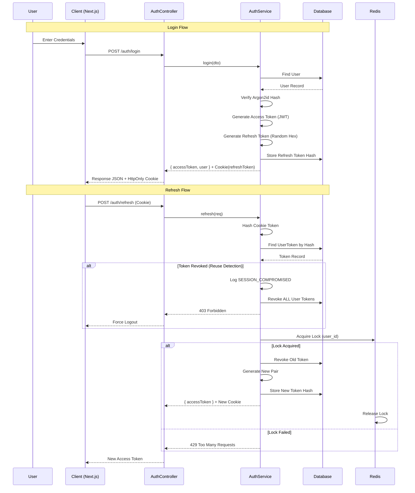

# Architecture Overview

## 1. Project Overview
- **Project Name**: Laba Platform
- **Vision**: Multi-branch management platform (Farm, Homestay, Cafe) with booking, e-commerce, POS, CRM capabilities
- **Architecture Style**: Plugin-based Modular Monolith - Core Platform + Feature Modules
- **Current Phase**: Phase 1 COMPLETED (Auth, Users, Basic CMS), Phase 2 INCOMING (Booking)
- **Target Audience**: Internal development team and future maintainers

## 2. Tech Stack
```yaml
Backend:
  Framework: NestJS 10.x with TypeScript 5.3+
  Architecture: Modular Monolith (NOT microservices)
  ORM: Prisma 5.9 with PostgreSQL 15
  Connection Pool: connection_limit=20 (in DATABASE_URL)
  Cache: Redis 7.x (rate limiting, rotation lock)
  Authentication: JWT + HttpOnly Cookie + Argon2id
    - Access Token: 15 minutes, stored in memory
    - Refresh Token: 30 days, stored as SHA256 hash in DB
  Monitoring: Prometheus metrics + Grafana dashboards
  Testing: Jest (unit), k6 (load), Pact (contract testing)

Frontend:
  Framework: Next.js 14 App Router
  Language: TypeScript 5.3+
  Styling: Tailwind CSS 3.4
  State Management: React Context (Auth only)
  HTTP Client: Axios with interceptors for 401 refresh
  Deployment: Static export (for public) + SSR (for admin)

Infrastructure:
  Development: Docker Compose (Postgres + Redis + Mailhog)
  CI/CD: GitHub Actions (Pact verification)
  Environment: .env validated by Joi schema
```

## 3. Authentication Flow


## 4. Module Architecture Matrix

| Module | Path | Dependencies | Status | Core/Plugin | Key Permissions |
|--------|------|--------------|--------|-------------|-----------------|
| auth | `src/auth/` | prisma, jwt | COMPLETED | Core | `auth.*`, `user.login` |
| users | `src/users/` | prisma, auth | COMPLETED | Core | `user.view`, `user.update` |
| cms | `src/cms/` | prisma | BUILDING | Plugin | `post.*`, `page.*` |
| branches | `src/branches/` | prisma | BUILDING | Plugin | `branch.*` |
| monitoring | `src/monitoring/` | prometheus | COMPLETED | Core | `metrics.view` |
| booking | `src/booking/` | prisma | PHASE_2 | Plugin | `booking.*` |

## 5. Database Schema

**User model** (See `prisma/schema.prisma`):
- `id`: Int @id @default(autoincrement)
- `email`: String @unique
- `password_hash`: String (argon2id hash, never logged)
- `token_version`: Int @default(0) (kill switch for tokens)
- `failed_login_attempts`: Int @default(0)
- `lock_until`: DateTime? (account lock timestamp)
- `is_super_admin`: Boolean @default(false) (bypass permission checks - *Note: Implemented via Roles in current schema*)
- `created_at`: DateTime @default(now())
- `updated_at`: DateTime @updatedAt
- `deleted_at`: DateTime? (soft delete)

**UserToken model**:
- `id`: Int @id @default(autoincrement())
- `user_id`: Int (foreign key)
- `refresh_token_hash`: String (SHA256 of token, indexed)
- `device_hash`: String (IPv4/24 or IPv6/64 fingerprint)
- `device_info`: Json? (userAgent, platform)
- `expires_at`: DateTime
- `revoked_at`: DateTime?

**Branch model**:
- `id`: Int, `code`: String (unique), `name`: String, `address`: String, `phone`: String, `created_at`: DateTime, `updated_at`: DateTime, `deleted_at`: DateTime?

**Post model** (Planned for CMS module):
- `id`: Int
- `type`: Enum (PAGE|BLOG|NEWS)
- `slug`: String (unique)
- `title`: String
- `excerpt`: String
- `content`: Json
- `thumbnailUrl`: String
- `authorId`: Int
- `isPublished`: Boolean
- `publishedAt`: DateTime
- `timestamps`: (created_at, updated_at)
- `deletedAt`: DateTime?

## 6. API Endpoints Structure
```
/api/v1/
├── auth/                     # Public routes
│   ├── POST /auth/register
│   ├── POST /auth/login
│   ├── POST /auth/refresh    # Requires HttpOnly cookie
│   ├── DELETE /auth/logout
│   └── GET /auth/me
├── public/                   # No auth required
│   ├── GET /posts?type=&slug=
│   └── GET /branches?isActive=true
└── admin/                    # Requires JWT + Permissions
    ├── GET /admin/users (permission: user.view)
    ├── PUT /admin/users/:id/lock (permission: user.lock)
    ├── GET /admin/branches (permission: branch.view)
    └── POST /admin/branches (permission: branch.create)
```

## 7. Security Implementation

- **Password Storage**: Argon2id with parameters `memoryCost=19456`, `timeCost=2`, `parallelism=1` (See `src/auth/auth.service.ts`).
- **Token Storage**: Access token NEVER stored server-side, Refresh token stored as SHA256 hash in `user_tokens` table.
- **Rate Limiting**: 
  - Login: 5 attempts / 1 minute per user.
  - Refresh: 10 attempts / 5 minutes per IP.
  - Fail-open: If Redis down, rate limit disabled (no app crash).
- **CORS**: Origins from environment variable `CORS_ORIGIN`, NO wildcard in production.
- **Helmet**: CSP disabled for Next.js streaming compatibility.
- **Device Fingerprint**: Log IPv4/24 subnet, IPv6/64 subnet (DO NOT store full IP for privacy).
- **Account Lock**: Progressive lock - 5 failed attempts within 15 minutes → lock 15 minutes (See `handleLoginFailure` in `AuthService`).
- **Webhook Alerts**: On token reuse detection, POST to `ALERT_WEBHOOK_URL` with `{ event: 'SESSION_COMPROMISED', userId, timestamp }`.

## 8. Performance & Scalability
- **Database**: Every query MUST use Prisma `select` to avoid SELECT *.
- **Indexes**: All foreign keys, soft delete fields, and frequently queried fields must be indexed.
- **Connection Pool**: PostgreSQL pool size = 20 (match instance count).
- **Redis**: 
  - Use for rate limiting only (no session storage).
  - TTL 60s for rate limit keys.
  - Fail-open on Redis connection errors.
- **Frontend**: 
  - Access token in memory only (NO localStorage).
  - Silent refresh deduplication via BroadcastChannel.
  - Page components use React Server Components where possible.

## 9. Development Workflow
```bash
# Setup (run exactly in this order)
git clone <repo>
cd backend
npm install
cp .env.example .env
npm run generate-secrets
docker compose -f docker-compose.dev.yml up -d
npx prisma migrate reset --force  # Seeds DB
npm run start:dev

# Testing
npm run test:watch
npm run test:e2e
npm run k6:test auth-flow

# Code quality
npm run lint
npm run format
npm run type-check
```

## 10. Deployment Checklist
- [ ] Environment variables validated by Joi schema (See `src/config/config.validation.ts`)
- [ ] Database migrations run (`prisma migrate deploy`)
- [ ] Redis available for rate limiting
- [ ] Prometheus scraping configured
- [ ] Helmet middleware enabled
- [ ] CORS origins restricted
- [ ] Secrets generated and not using defaults
- [ ] Health check endpoint responding
- [ ] Metrics endpoint protected by BasicAuth
